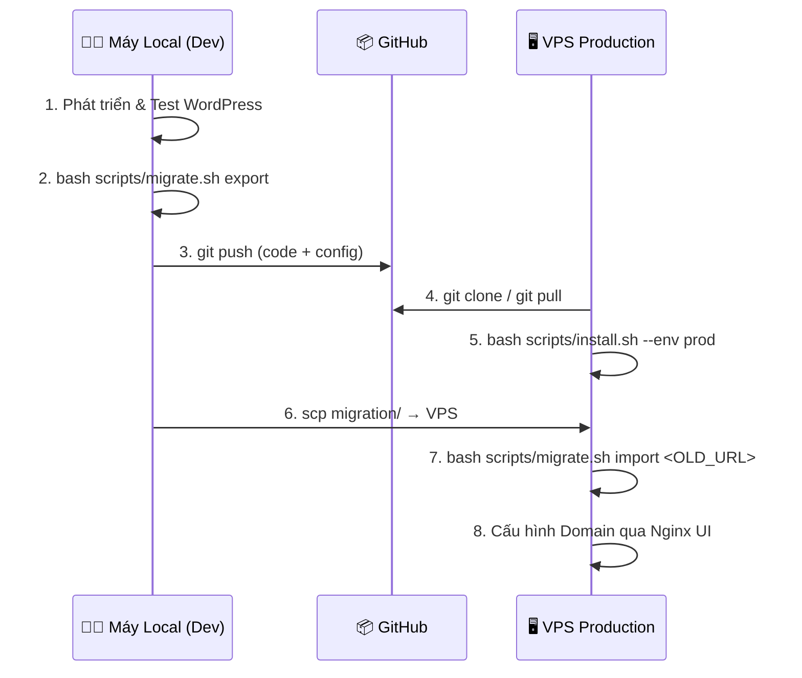
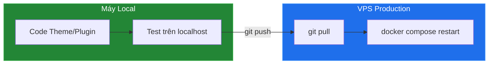
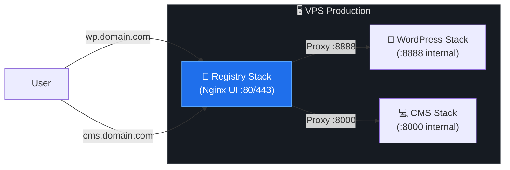

# 🚀 Hướng dẫn Triển khai VPS & Migration (Deployment Guide)

Tài liệu này trình bày **quy trình chuyên nghiệp** để chuyển WordPress từ Local Development lên VPS Production, được thiết kế theo tiêu chuẩn **Senior WordPress Developer**.

---

## 🏗️ Kiến trúc Triển khai



---

## ⚠️ Vấn đề Cốt lõi khi Di chuyển WordPress

> [!CAUTION]
> WordPress lưu **URL tuyệt đối** (absolute URL) trong database — bao gồm `siteurl`, `home`, nội dung bài viết, widget, theme options, và **serialized data**. Nếu chỉ đơn giản tìm-thay thế bằng SQL `UPDATE`, bạn sẽ **phá hỏng serialized data** và gây lỗi trắng trang.

### Giải pháp: WP-CLI `search-replace`

```bash
# Lệnh này xử lý AN TOÀN serialized data (tự động tính lại string length)
wp search-replace 'http://localhost:8888' 'https://yourdomain.com' \
    --all-tables --precise --recurse-objects --skip-columns=guid
```

Script `migrate.sh` đã tích hợp sẵn lệnh này — bạn không cần làm thủ công.

---

## 📋 Quy trình Chi tiết

### Giai đoạn 1: Chuẩn bị trên Local

**1. Hoàn thiện WordPress trên Local:**
```bash
# Đảm bảo WordPress đang chạy tốt
docker compose ps
# Kiểm tra website: http://localhost:8888
```

**2. Export dữ liệu (Database + Media):**
```bash
bash scripts/migrate.sh export
```

Script sẽ tạo thư mục `migration/` chứa:
- `db_latest.sql` — Full database dump (mysqldump --single-transaction)
- `uploads_latest.tar.gz` — Toàn bộ wp-content/uploads (media files)

---

### Giai đoạn 2: Thiết lập VPS

**1. SSH vào VPS và clone repo:**
```bash
ssh user@VPS_IP
git clone https://github.com/tuquet/launchpad-wp-stack.git
cd launchpad-wp-stack
```

**2. One-Click Install (Production mode):**
```bash
bash scripts/install.sh --env prod
```

Script sẽ tự động:
- Sinh mật khẩu DB và WordPress Salts mới (unique cho production)
- Set `COMPOSE_FILE=compose.prod.yml` (DB port ẩn, single volume)
- Pull WordPress + MariaDB images
- Khởi chạy containers với healthcheck

**3. Verify WordPress đang chạy:**
```bash
docker compose ps
# Cả 2 containers phải hiển thị "(healthy)"
```

---

### Giai đoạn 3: Migration — Chuyển dữ liệu từ Local lên VPS

**1. Copy migration data lên VPS (chạy trên máy Local):**
```bash
scp -i ~/.ssh/your_key -r migration/ user@VPS_IP:/path/to/launchpad-wp-stack/
```

**2. Import dữ liệu trên VPS:**
```bash
bash scripts/migrate.sh import http://localhost:8888
```

Script sẽ tự động:
- Import database dump vào MariaDB
- Giải nén media uploads vào wp-content/uploads
- Chạy `wp search-replace` để thay thế URL cũ → URL mới (IP VPS)
- Fix file ownership (www-data)

---

### Giai đoạn 4: Cấu hình Domain (Nginx UI)

Sử dụng **LaunchPad Registry Stack (Nginx UI)** đang chạy trên VPS để proxy WordPress:

**1. Trỏ DNS:** Tạo A Record `wp.yourdomain.com` → IP VPS

**2. Tạo Site trong Nginx UI:**
- **Server Name:** `wp.yourdomain.com`
- **Listen:** `80`
- **Location /**:
  - **Proxy Pass:** `http://127.0.0.1:8888`
  - Bật: `X-Real-IP`, `X-Forwarded-For`, `X-Forwarded-Proto`
  - Set Host: `$host` (Preserve Host)

**3. Bật SSL:**
- Tab **SSL** → Enable SSL → Let's Encrypt → Điền Email → Issue

**4. Cập nhật URL trong WordPress:**
```bash
docker compose run --rm wpcli wp search-replace \
    'http://VPS_IP:8888' 'https://wp.yourdomain.com' \
    --all-tables --precise --recurse-objects --skip-columns=guid
```

---

## 🔄 Quy trình Cập nhật Hàng ngày



### Cập nhật Code (Theme/Plugin)

```bash
# Local: Push code
git add -A && git commit -m "update theme" && git push

# VPS: Pull và restart
cd /path/to/launchpad-wp-stack
git pull
docker compose restart wordpress
```

### Cập nhật WordPress Core

```bash
# Trên VPS
docker compose run --rm wpcli wp core update
docker compose run --rm wpcli wp plugin update --all
docker compose run --rm wpcli wp theme update --all
```

### Backup trước khi cập nhật

```bash
# Luôn export trước khi update
bash scripts/migrate.sh export
```

---

## 🔐 Checklist Bảo mật Production

- [ ] Đổi `WP_DEBUG=false` trong `.env`
- [ ] DB port **KHÔNG** expose ra ngoài (compose.prod.yml đã xử lý)
- [ ] Tất cả secrets đều là random (copy-env.sh tự sinh)
- [ ] SSL/HTTPS đã bật qua Nginx UI
- [ ] Disable XML-RPC: `docker compose run --rm wpcli wp config set 'XMLRPC_ENABLED' false --type=constant`
- [ ] Limit login attempts: cài plugin Limit Login Attempts Reloaded
- [ ] Firewall chỉ mở port 80, 443 (port 8888 chặn ở firewall, chỉ proxy nội bộ)

---

## 🛠️ Xử lý Sự cố

### WordPress trắng trang sau migrate

```bash
# Kiểm tra logs
docker compose logs wordpress --tail 50

# Flush cache + permalinks
docker compose run --rm wpcli wp cache flush
docker compose run --rm wpcli wp rewrite flush
```

### URL vẫn trỏ về localhost

```bash
# Kiểm tra URL hiện tại
docker compose run --rm wpcli wp option get siteurl
docker compose run --rm wpcli wp option get home

# Sửa thủ công nếu cần
docker compose run --rm wpcli wp option update siteurl 'https://yourdomain.com'
docker compose run --rm wpcli wp option update home 'https://yourdomain.com'
```

### Permission denied (uploads)

```bash
docker exec wordpress chown -R www-data:www-data /var/www/html/wp-content/uploads
```

---

## 🌌 Tích hợp Hệ sinh thái LaunchPad



Nginx UI (Registry Stack) đóng vai trò **Reverse Proxy trung tâm** cho tất cả các stack:
- `wp.yourdomain.com` → `http://127.0.0.1:8888` (WordPress Stack)
- `cms.yourdomain.com` → `http://127.0.0.1:8000` (CMS Fullstack)
