# 🗺️ Chiến lược Phát triển & Mở rộng WordPress

Tài liệu này trình bày chiến lược phát triển WordPress **có khả năng mở rộng (Scalable)** từ giai đoạn MVP đến Enterprise, được thiết kế để tích hợp liền mạch với hệ sinh thái **LaunchPad**.

---

## 📐 Tổng quan Kiến trúc Hiện tại

Kiến trúc ban đầu được thiết kế theo mô hình **Single-Node Docker**, tối ưu cho giai đoạn phát triển và triển khai nhanh trên 1 VPS duy nhất.

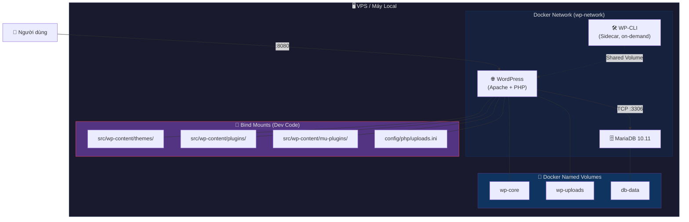

---

## 🛤️ Lộ trình Phát triển theo Giai đoạn

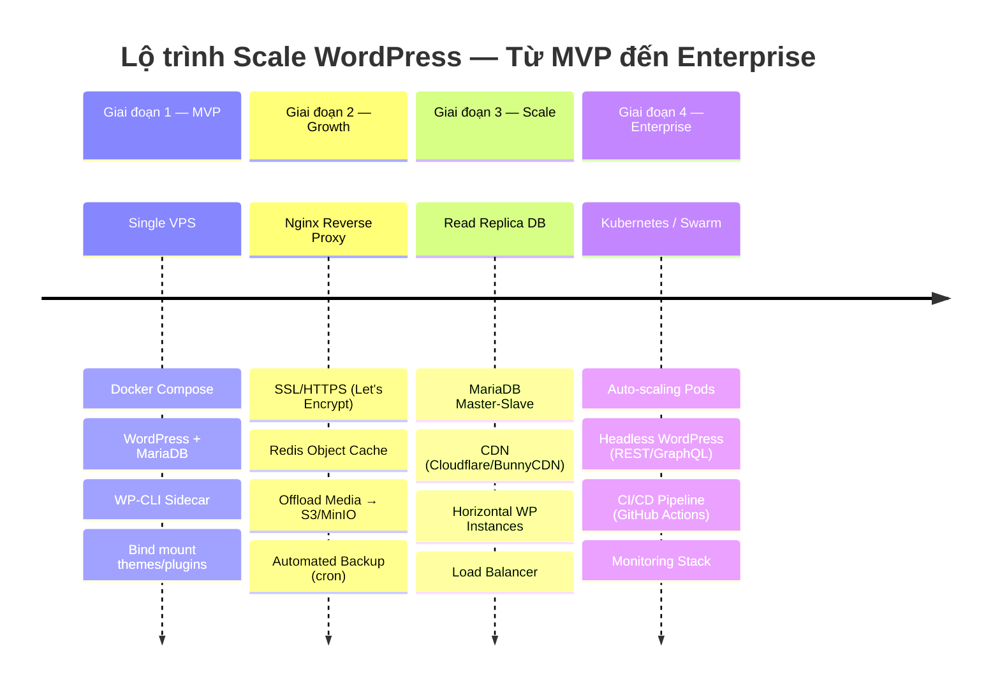

---

## 🏗️ Giai đoạn 1 — MVP (Hiện tại)

> **Mục tiêu:** Lên sản phẩm nhanh, chi phí tối thiểu, nền tảng vững chắc cho tương lai.

### Thành phần hiện có

| Service | Image | Vai trò |
|---|---|---|
| `wordpress` | `wordpress:latest` | Web server (Apache + PHP) |
| `wp-db` | `mariadb:10.11` | Database server |
| `wpcli` | `wordpress:cli` | CLI administration (on-demand) |

### Quy trình Dev Workflow hiện tại

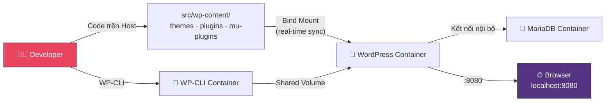

### ✅ Checklist MVP

- [x] Docker Compose với healthcheck
- [x] Auto-generate passwords & WP Salts
- [x] Bind mount themes/plugins/mu-plugins
- [x] Custom PHP config (upload 256MB, memory 512MB)
- [x] WP-CLI sidecar
- [x] One-click install script
- [ ] Triển khai lên VPS Production

---

## 🚀 Giai đoạn 2 — Growth (Tối ưu & Bảo mật)

> **Mục tiêu:** Cải thiện hiệu năng, bảo mật HTTPS, và tự động hóa backup.

### Kiến trúc mục tiêu

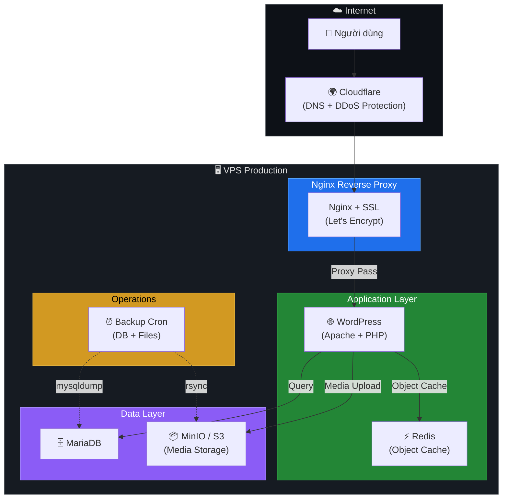

### Thành phần mới cần bổ sung

| # | Thành phần | Mục đích | Ưu tiên |
|---|---|---|---|
| 1 | **Nginx Reverse Proxy** | SSL termination, gzip, security headers | 🔴 Cao |
| 2 | **Redis Object Cache** | Cache database queries, giảm tải MariaDB 40-60% | 🔴 Cao |
| 3 | **MinIO / S3 Offload** | Tách media ra khỏi server, giảm disk I/O | 🟡 Trung bình |
| 4 | **Automated Backup** | Backup DB + files tự động hàng ngày | 🔴 Cao |
| 5 | **Fail2Ban** | Chống brute-force wp-login.php | 🟡 Trung bình |

### Compose mở rộng cho Growth

```yaml
# compose.growth.yml (extend từ compose.yml)
services:
  # ── Nginx Reverse Proxy + SSL ──
  nginx:
    image: nginx:alpine
    ports:
      - "80:80"
      - "443:443"
    volumes:
      - ./config/nginx/conf.d:/etc/nginx/conf.d:ro
      - ./config/nginx/ssl:/etc/nginx/ssl
    depends_on:
      wordpress:
        condition: service_healthy

  # ── Redis Object Cache ──
  redis:
    image: redis:7-alpine
    restart: unless-stopped
    command: redis-server --maxmemory 128mb --maxmemory-policy allkeys-lru
    volumes:
      - redis-data:/data
    healthcheck:
      test: ["CMD", "redis-cli", "ping"]
      interval: 10s

  # WordPress cần thêm biến môi trường cho Redis
  wordpress:
    environment:
      WP_REDIS_HOST: redis
      WP_REDIS_PORT: 6379
    depends_on:
      redis:
        condition: service_healthy

volumes:
  redis-data:
```

### Tích hợp với LaunchPad Registry Stack

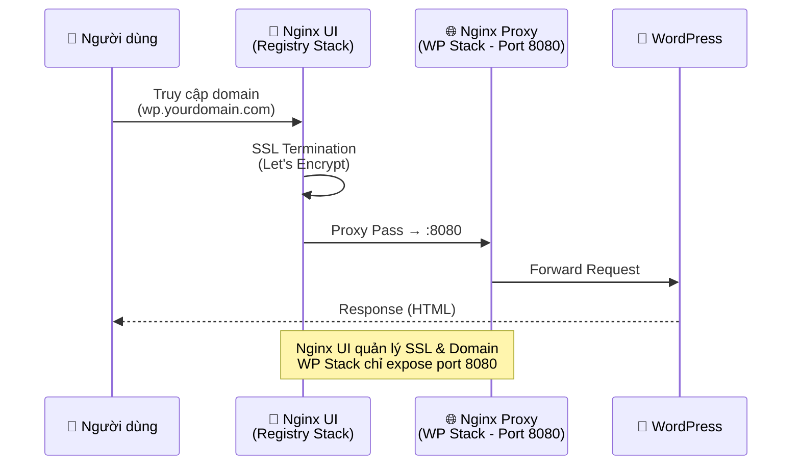

---

## 📈 Giai đoạn 3 — Scale (Mở rộng hạ tầng)

> **Mục tiêu:** Xử lý lưu lượng truy cập lớn, đảm bảo high availability.

### Kiến trúc Horizontal Scaling

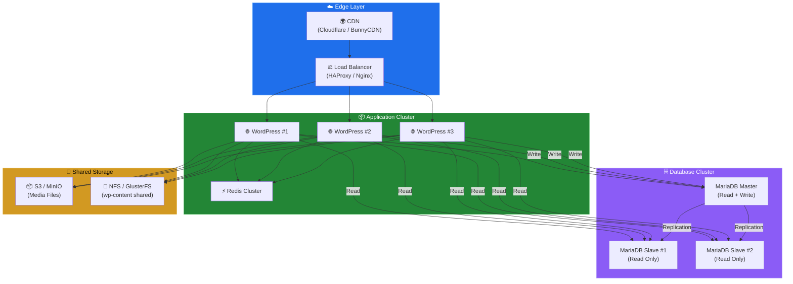

### Thách thức khi Scale WordPress & Giải pháp

| Thách thức | Vấn đề | Giải pháp |
|---|---|---|
| **Session Sharing** | Mỗi WP instance có session riêng | Dùng Redis làm session handler |
| **File Uploads** | Media chỉ lưu trên 1 instance | S3/MinIO offload + CDN |
| **wp-content Sync** | Theme/Plugin cần giống nhau trên mọi node | NFS shared volume hoặc Git deploy |
| **Database Bottleneck** | Single DB chịu tải kém | Master-Slave replication + read splitting |
| **Cache Invalidation** | Object cache không đồng bộ giữa nodes | Redis Cluster (centralized cache) |
| **Cron Jobs** | `wp-cron.php` chạy trên mọi instance | Disable WP-Cron, dùng system cron trên 1 node duy nhất |

### Cấu hình Read/Write Splitting

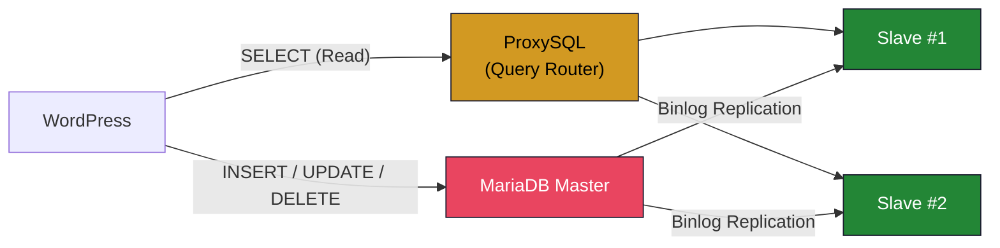

> [!TIP]
> Plugin **HyperDB** (do Automattic phát triển) hỗ trợ read/write splitting native cho WordPress mà không cần ProxySQL. Đặt file `db.php` vào `wp-content/` là đủ.

---

## 🏢 Giai đoạn 4 — Enterprise (Headless & CI/CD)

> **Mục tiêu:** Tách biệt Frontend/Backend, tự động hóa triển khai, monitoring toàn diện.

### Kiến trúc Headless WordPress

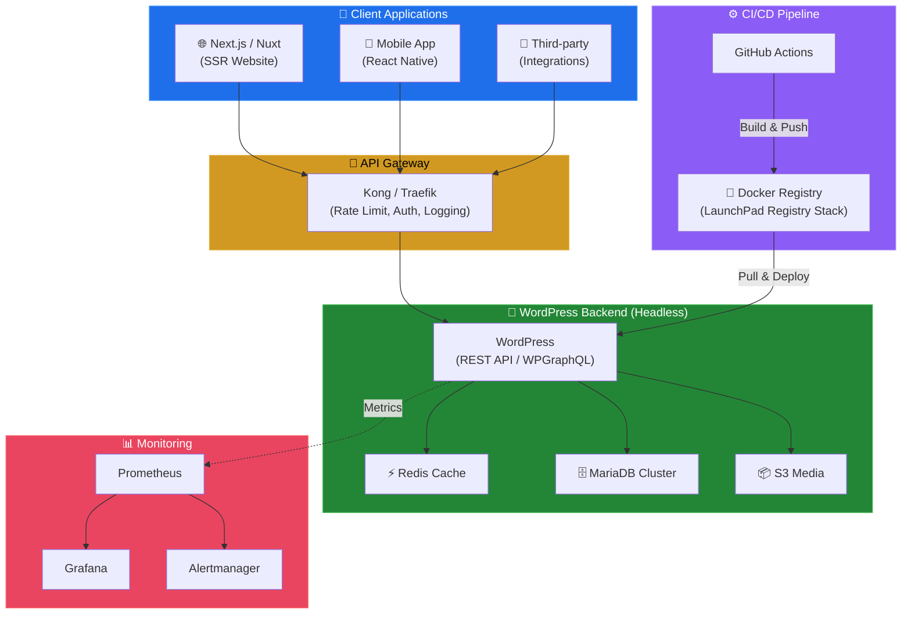

### CI/CD Pipeline với LaunchPad Registry Stack

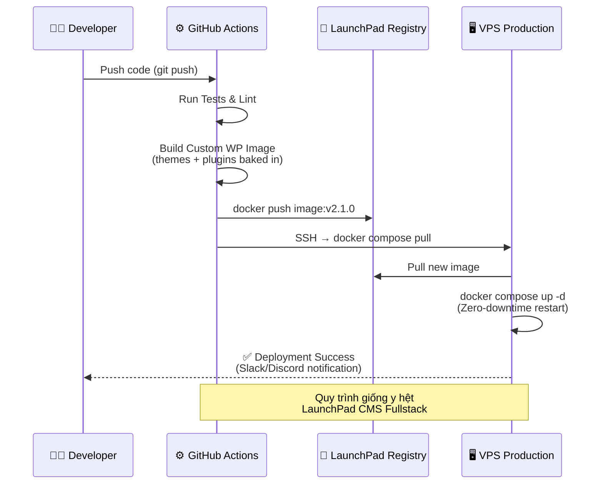

### Custom WordPress Docker Image (Production)

Khi scale lên enterprise, theme/plugin **không nên bind mount** mà cần **bake vào Docker Image** để đảm bảo tính nhất quán:

```dockerfile
# Dockerfile.production
FROM wordpress:latest

# ── PHP Configuration ──
COPY config/php/uploads.ini /usr/local/etc/php/conf.d/uploads.ini

# ── Themes & Plugins (Baked-in) ──
COPY src/wp-content/themes/ /var/www/html/wp-content/themes/
COPY src/wp-content/plugins/ /var/www/html/wp-content/plugins/
COPY src/wp-content/mu-plugins/ /var/www/html/wp-content/mu-plugins/

# ── Security Hardening ──
RUN chown -R www-data:www-data /var/www/html/wp-content
```

---

## 🔐 Chiến lược Bảo mật theo Giai đoạn

```mermaid
graph LR
    subgraph PHASE1["🟢 Giai đoạn 1 — MVP"]
        S1["✅ WP Salts tự động sinh"]
        S2["✅ DB password ngẫu nhiên"]
        S3["✅ Docker network cô lập"]
    end

    subgraph PHASE2["🟡 Giai đoạn 2 — Growth"]
        S4["🔒 SSL / HTTPS"]
        S5["🔒 Fail2Ban (brute-force)"]
        S6["🔒 .htaccess hardening"]
        S7["🔒 Disable XML-RPC"]
        S8["🔒 DB port không expose ra ngoài"]
    end

    subgraph PHASE3["🔴 Giai đoạn 3 — Scale"]
        S9["🛡️ WAF (ModSecurity)"]
        S10["🛡️ DDoS Protection (CF)"]
        S11["🛡️ IP Whitelist cho wp-admin"]
    end

    subgraph PHASE4["⚫ Giai đoạn 4 — Enterprise"]
        S12["🔐 API Gateway + JWT"]
        S13["🔐 RBAC (Role-Based Access)"]
        S14["🔐 Audit Logging"]
        S15["🔐 Vulnerability Scanning"]
    end

    PHASE1 --> PHASE2 --> PHASE3 --> PHASE4

    style PHASE1 fill:#238636,stroke:#3fb950,color:#fff
    style PHASE2 fill:#d29922,stroke:#e3b341,color:#000
    style PHASE3 fill:#e94560,stroke:#ff6b6b,color:#fff
    style PHASE4 fill:#1a1a2e,stroke:#533483,color:#e0e0e0
```

---

## 📦 Chiến lược Backup & Disaster Recovery

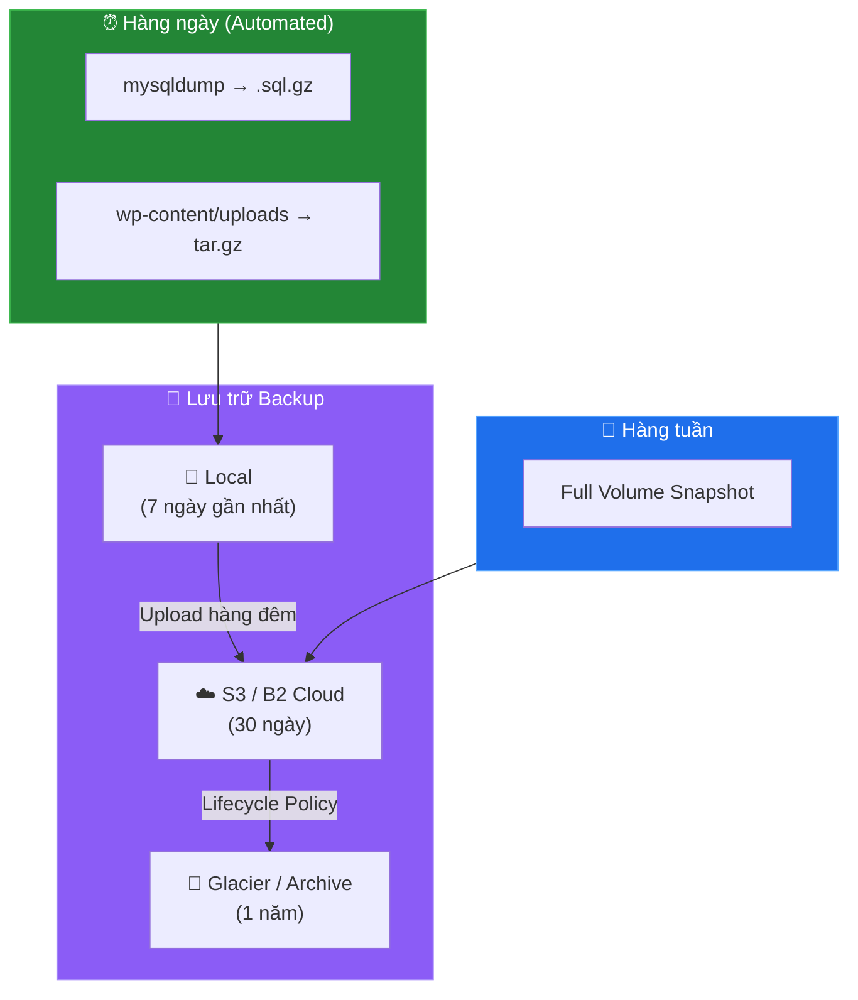

### Lệnh Backup thủ công (WP-CLI)

```bash
# Backup Database
docker compose run --rm wpcli wp db export /var/www/html/backup-$(date +%Y%m%d).sql

# Backup toàn bộ wp-content
docker compose run --rm wpcli tar -czf /var/www/html/wp-content-backup.tar.gz /var/www/html/wp-content/
```

---

## 📊 Monitoring & Observability (Giai đoạn 3+)

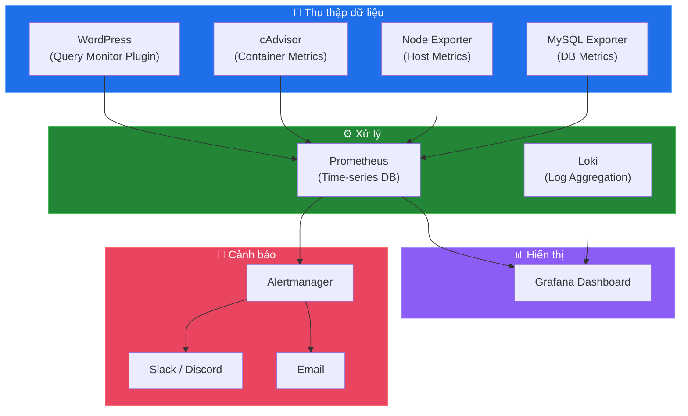

### Các Metrics cần theo dõi

| Metric | Cảnh báo khi | Hành động |
|---|---|---|
| CPU Usage | > 80% trong 5 phút | Scale thêm WP instance |
| Memory Usage | > 85% | Tăng PHP `memory_limit` hoặc thêm RAM |
| DB Connections | > 100 concurrent | Bật connection pooling / thêm read replica |
| Response Time (P95) | > 2 giây | Kiểm tra slow queries, bật Redis cache |
| Disk Usage | > 80% | Offload media sang S3, chạy `cleanup.sh` |
| Error Rate (5xx) | > 1% | Kiểm tra logs, rollback nếu cần |

---

## 🔄 So sánh Kiến trúc theo Giai đoạn

| Tiêu chí | MVP | Growth | Scale | Enterprise |
|---|---|---|---|---|
| **Số server** | 1 VPS | 1 VPS | 2-5 VPS | Kubernetes Cluster |
| **Database** | Single MariaDB | Single + Backup | Master-Slave | Galera Cluster |
| **Cache** | Không | Redis Object Cache | Redis Cluster | Redis Sentinel |
| **Media** | Docker Volume | Docker Volume | S3/MinIO | S3 + CDN |
| **SSL** | Không | Let's Encrypt | Let's Encrypt | Wildcard SSL |
| **CI/CD** | Manual | Script | GitHub Actions | Full Pipeline |
| **Monitoring** | `docker logs` | Query Monitor | Prometheus + Grafana | Full Stack |
| **Backup** | Manual | Cron daily | Cron + S3 | Multi-region |
| **Traffic** | ~1K/ngày | ~10K/ngày | ~100K/ngày | ~1M+/ngày |
| **Chi phí/tháng** | ~$5-10 | ~$15-30 | ~$100-300 | ~$500+ |

---

## 🌌 Tích hợp Hệ sinh thái LaunchPad

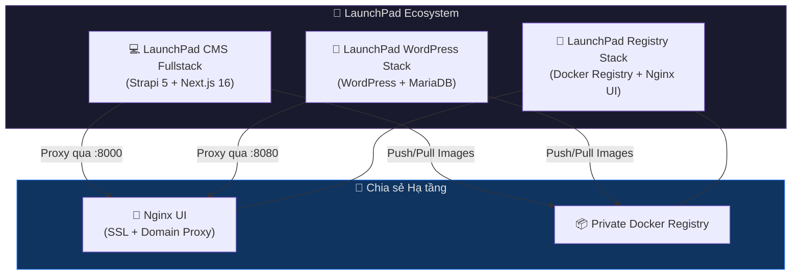

> [!IMPORTANT]
> Tất cả các stack trong hệ sinh thái LaunchPad đều chia sẻ chung các quy ước:
> - **Script pattern:** `copy-env.sh` (sinh secrets), `install.sh` (one-click), `reset.sh`, `cleanup.sh`
> - **Secret pattern:** Placeholder `tobemodified_*` → auto-replace bằng `openssl rand`
> - **Compose pattern:** `compose.yml` (dev) + `compose.prod.yml` (production)
> - **Deploy pattern:** Build Local → Push Registry → Pull VPS → Zero-downtime restart

---

## 📌 Hành động tiếp theo (Next Steps)

Dựa trên lộ trình phía trên, những việc ưu tiên cao nhất để chuyển từ MVP → Growth:

1. **Tạo `compose.prod.yml`** — Nginx reverse proxy + SSL + không expose DB port
2. **Thêm Redis** — Cài plugin [Redis Object Cache](https://wordpress.org/plugins/redis-cache/) + thêm service Redis vào compose
3. **Viết Backup Script** — `scripts/backup.sh` + cron job hàng đêm
4. **Security Hardening** — Disable XML-RPC, limit login attempts, `.htaccess` rules
5. **Tích hợp LaunchPad Registry Stack** — Nginx UI quản lý SSL/Domain cho WordPress
